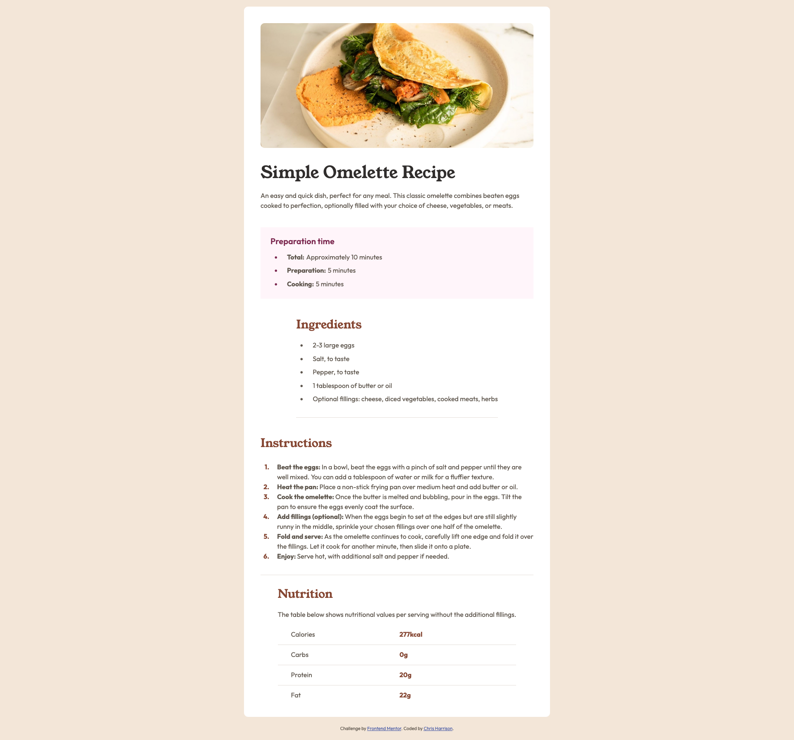

# Frontend Mentor - Recipe page solution

This is a solution to the [Recipe page challenge on Frontend Mentor](https://www.frontendmentor.io/challenges/recipe-page-KiTsR8QQKm). Frontend Mentor challenges help you improve your coding skills by building realistic projects.

## Table of contents

- [Frontend Mentor - Recipe page solution](#frontend-mentor---recipe-page-solution)
  - [Table of contents](#table-of-contents)
  - [Overview](#overview)
    - [Screenshot](#screenshot)
    - [Links](#links)
  - [My process](#my-process)
    - [Built with](#built-with)
    - [What I learned](#what-i-learned)
    - [Continued development](#continued-development)
    - [Useful resources](#useful-resources)
  - [Author](#author)

## Overview

### Screenshot



### Links

- Solution URL: [Frontend Mentor Solution](https://your-solution-url.com)
- Live Site URL: [Live Site](https://ckharrison.github.io/recipe-page/)

## My process

### Built with

- Semantic HTML5 markup
- CSS custom properties
- Flexbox
- CSS Grid
- Mobile-first workflow

### What I learned

The two main things I worked on in this challenge was styling the bullet points to be a different color, as well as adding custom spacing to the list style markers, that took some Googling! Also, refreshing my knowledge of CSS Grid as it's been a while since I've used it. I love CSS grid, it's so nice, much easier to use then Bootstrap back in the day.

```css
/* Bullet point styling */
.prep-list {
  display: flex;
  flex-direction: column;
  gap: var(--spacing-100);
  margin: 0;
}

.prep-item::marker {
  color: var(--color-rose-800);
}
```

### Continued development

I'll continue to refresh my knowledge of CSS Grid but that shouldn't be too difficult. I used to use it a lot with my front facing personal business a couple years ago.

### Useful resources

- [CSS Tips and Tricks - Custom Bullet Points](https://css-tricks.com/everything-you-need-to-know-about-the-gap-after-the-list-marker/) - As always the ever helpful CSS Tips and Tricks had a great article on styling bullet points
- [CSS Tips and Tricks - CSS Grid](https://css-tricks.com/snippets/css/complete-guide-grid/) - Still the best resource on the internet for a reference on CSS Grid.

## Author

- Website - [Chris Harrison](https://www.charrsion.dev)
- Frontend Mentor - [@CKHarrison](https://www.frontendmentor.io/profile/CKHarrison)
